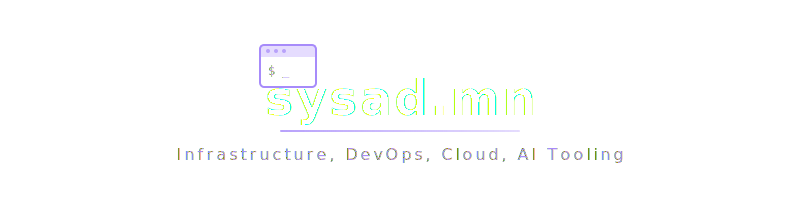

<p align="center"></p>

<p align="center">
  <a href="https://jekyllrb.com/"></a>
  <a href="https://pages.github.com/"></a>
  <a href="https://www.ruby-lang.org/"></a>
  <a href="https://sysad.mn"></a>
</p>

---

> Personal website and blog for Gerald Sim — Systems Administrator, DevOps Engineer, and Technology Professional

**Live Site**: [sysad.mn](https://sysad.mn)
**Repository Type**: Public (GitHub Pages)

## Purpose

Professional showcase featuring:
- Interactive CV/Resume
- Technical blog posts
- Project portfolio
- Professional networking

## Tech Stack

- **Framework**: Jekyll (Ruby-based static site generator)
- **Hosting**: GitHub Pages (Free)
- **Domain**: sysad.mn via Cloudflare
- **SSL/CDN**: Cloudflare Free tier
- **Content**: Markdown + Liquid templating

## Structure

```
sysad.mn/
├── _posts/           # Blog posts (Markdown)
├── _pages/           # Static pages (About, CV, Contact)
├── _layouts/         # Page templates
├── _includes/        # Reusable components
├── _sass/           # Styling (SCSS)
├── _data/           # Site data (YAML/JSON)
├── assets/          # Images, CSS, JS
└── _config.yml      # Jekyll configuration
```

## Development

### Setup Requirements
- Docker installed locally
- Adjacent directory structure:
  ```
  Projects/
  ├── sysad.mn/        (this repo - public)
  └── sysad.mn-ops/    (automation repo - private)
  ```

### Running Locally
Development is managed through the private ops repository:
1. Clone both repositories side by side
2. Use development scripts from `sysad.mn-ops`
3. All changes to this repo are automatically reflected

### Local Setup (Optional)
```bash
# Install Jekyll locally
gem install bundler jekyll
bundle install
bundle exec jekyll serve
```

### Content Creation
```bash
# New blog post
touch _posts/YYYY-MM-DD-post-title.md

# New page
touch _pages/page-name.md
```

## Professional Links

- **LinkedIn**: [geraldsim](https://www.linkedin.com/in/geraldsim/)
- **GitHub**: [meappy](https://github.com/meappy)
- **Email**: Available via contact form

## Automation

Content generation and deployment automation handled by private ops repository:
`sysad.mn-ops` (AI agents, deployment scripts, monitoring)

---

*This is a public repository showcasing professional work and technical insights.*
